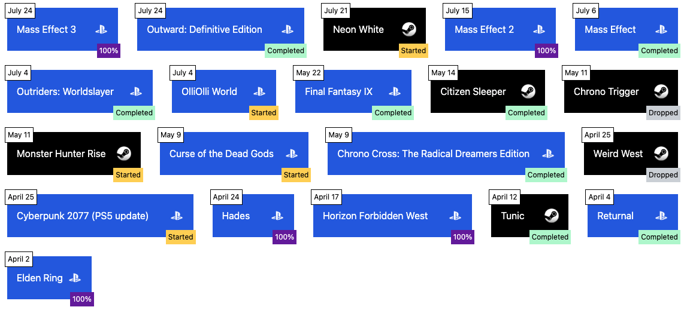

About six months ago, I decided to try and better track the games I play. In years past, I've scrambled to put together a list every January, grasping for memories of the games I played the year before.

[It ends up looking something like this.](https://seth-blog-old.netlify.app/the-games-i-played-in-2020/)

Which is fine, but I only spend time thinking about it while I write that post, and then never think about it again. I wanted something different.

There's services out there that do something like this for you. The Backloggery comes to mind, HowLongToBeat works, I could just throw everything into a spreadsheet. But since I was already using Notion for note-taking, I decided to explore using a Notion database to track my gaming habits.

It's gone through a few iterations since then, and this is the latest version:

The props I'm currently tracking are:

- Title
- Platform
- Progress (Started, Completed, 100%, Dropped)
- Tags
- Score
- Last played
- First played
- Release date
- Developer

This gives me powerful options for sorting and filtering. I have a few different saved views to show only games I've completed, a timeline based off first and last played that shows the timeframe in which I'm playing, and best of lists for years, sorted by score.

If you scroll down into last year there's a lot of data I haven't backfilled yet, and I probably never will, but this has felt like a good system so far. [See the live version here](https://sdehaan.notion.site/467f1ec097d64f30ad4aa11a7fe4409b?v=94228421ca9846d08254f6adf4b198cd), and you can duplicate and use for yourself if you like the format.

## Pulling Notion data into Gatsby

Of course, since I'm building another Gatsby site I've been playing with the ['gatsby-source-notion-api'](https://www.gatsbyjs.com/plugins/gatsby-source-notion-api/) to play with that data:

[Click here to see that grid in action.](/playing) I'm using a graphql query to create a grid of items from the latest 20 games in my tracker, with styling based on platform and progress. There's a drawback, and I haven't really explored a solution for this yet, but this grid only updates at build time. So if I deploy a commit on July 25, it will include the latest data at that time. If I update the tracker the next day in Notion, none of those changes will be reflected here until I deploy the site again. Could maybe solve this with a webhook in Netlify, but I also update the tracker most days and I don't necessarily want to deploy a new version of the site every time. So maybe it's fine? Works for now.

## Next steps

I'll keep refining the tracker as I think of new data that I'd like to have in there. It's all manually updated for now, and I'd love to explore some options for autocomplete or importing my gameplay using the Notion API, but that's beyond me for now.
